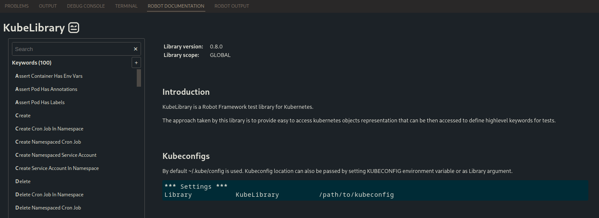

# Component tests

## Introduction

Cloud Toolkit leverages the tools that the Pulumi team offers to test that the components are being correctly created. Nonetheless, testing only that the pieces exist is not enough to validate that a component did not break with recently introduced changes.

The workflow of a component test consists of deploying a component or set of them, verifying that they function as expected and finally cleaning everything.

**Robot Framework** is an open source test automation framework for acceptance testing and acceptance test-driven development. Written in **Python**, it allows great flexibility in the development of test cases definition and the tools needed for test automatization.

## Set Up

### PyRobot installation

For local development is recommended that you install Robot Framework at the system level so that IDE plugins can work best.

```bash
$> python3 -m pip install -r requirements.txt
```

In the installation didn't set your robot binary on your `PATH`, you can create an alias for ease of use:

```bash
$> alias robot="python -m robot"
```

Remember to add it to your `.bashrc`, `.zshrc` or equivalent so that it is available at the start of the terminal session.

### Pulumi conf

Add to your PATH the Cloud Toolkit `bin` folder:

```bash
$> export PATH=$PATH:$(pwd)/../bin
```

**IMPORTANT!** - Checking for errors when performing Pulumi operations depends on reading the stderr after the `pulumi` command. If the stderr is empty the test will be marked as `pass`, if not, it means that it is a `fail`.
By default, if the system has a non up-to-date version of the Pulumi CLI Pulumi itself will print a warning to the stderr, instead of stdout. 

```
'warning: A new version of Pulumi is available. To upgrade from version '3.46.1' to '3.48.0', visit https://pulumi.com/docs/reference/install/ for manual instructions and release notes.' should be empty.
```

This will mark as failed every test that has a Pulumi operation. To avoid this behaviour export the following environment variable **before executing any test**:

```bash
$> export PULUMI_SKIP_UPDATE_CHECK=true
```

### Working with already existing stacks

Exporting the following variable will skip the creation of a new Pulumi stack, with its up and destroy, and instead will use an existing one:

```bash
$> export EXISTING_PULUMI_STACK="component-tests-20221130085639"
```

Keep in mind the stack has to exist within the Pulumi project.

### KubeLibrary setup

KubeLibrary will not find a valid kubeconfig file when executing the tests for the first time. The following error will show at the top of the tests logs:

```
==============================================================================
Test Suites
==============================================================================
[ ERROR ] Error in file '/Volumes/workspace/cloud-toolkit-aws-2/acceptance_tests/resources/keywords_library/kubernetes.robot' on line 5: Initializing library 'KubeLibrary' with arguments [ /Volumes/workspace/cloud-toolkit-aws-2/acceptance_tests/resources/keywords_library/../../resources/projects/kubernetes/kubeconfig ] failed: ConfigException: Invalid kube-config file. No configuration found.
Traceback (most recent call last):
  File "/Volumes/workspace/cloud-toolkit-aws-2/acceptance_tests/venv/lib/python3.9/site-packages/KubeLibrary/KubeLibrary.py", line 96, in __init__
    self.reload_config(kube_config=kube_config, context=context, api_url=api_url, bearer_token=bearer_token,
  File "/Volumes/workspace/cloud-toolkit-aws-2/acceptance_tests/venv/lib/python3.9/site-packages/KubeLibrary/KubeLibrary.py", line 253, in reload_config
    config.load_kube_config(kube_config, context)
  File "/Volumes/workspace/cloud-toolkit-aws-2/acceptance_tests/venv/lib/python3.9/site-packages/kubernetes/config/kube_config.py", line 813, in load_kube_config
    loader = _get_kube_config_loader(
  File "/Volumes/workspace/cloud-toolkit-aws-2/acceptance_tests/venv/lib/python3.9/site-packages/kubernetes/config/kube_config.py", line 770, in _get_kube_config_loader
    raise ConfigException(
kubernetes.config.config_exception.ConfigException: Invalid kube-config file. No configuration found.
```

While it shows as an error, it treats like a warning, meaning that it does not impact the test execution. To dismiss this warning, export the following environment variable before the test execution:

```bash
$> export INIT_FOR_LIBDOC_ONLY=1
```

### IDE extensions:

Robot Framework has support in the main IDEs used for Python development:

* [Code extension](https://open-vsx.org/extension/robocorp/robotframework-lsp)

You will most likely need to set the path to the Python executable that has robot installed in the settings of the extension.

KubeLibrary has a particular case; this library needs a valid `kubeconfig` file to load. This makes the IDE completion practically unusable since it needs to find a valid kubeconfig for the documentation to load. The `kubeconfig` is created when launching the kubernetes suite, so it cannot be ready before launching the tests themselves. To avoid this problem it is necessary to add `INIT_FOR_LIBDOC_ONLY=1` as an environment variable in `settings.json`:

```bash
{
    "robot.python.env": {
        "INIT_FOR_LIBDOC_ONLY": 1
    }
}
```

By default in the bottom bar, you can find the documentation of a particular library in the `ROBOT DOCUMENTATION` tab when hovering the mouse over it:



## Running locally 

Running all tests:

```bash
$> robot test_suites/
```

Running a specific test suite:

```bash
$> robot test_suites/kubernetes
```

Running a test case from a test suite:

```bash
$> robot -t "Deployment exists" test_suites/kubernetes
```

## Running with Docker

Set the following env vars that are going to get passed to the container:

```bash
$> export AWS_PROFILE=<AWS_PROFILE>
$> export AWS_PROFILE_CONFIG=<AWS_PROFILE_CONFIG>
$> export AWS_PROFILE_CREDENTIALS=<AWS_PROFILE_CREDENTIALS>
$> export PULUMI_ACCESS_TOKEN=<PULUMI_ACCESS_TOKEN>
```

You can use the provided dockerfile to build and run the container:

```bash
$> docker compose up --build 
```

The `--build` flag will rebuild the image everytime. Feel free to exclude if you don't need it.
